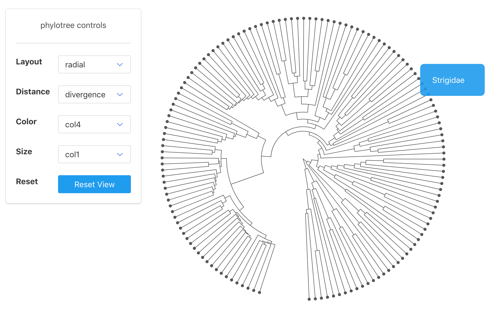
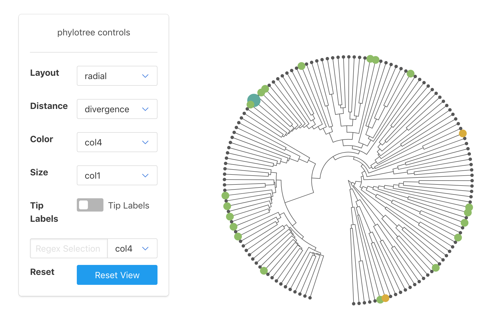

<!-- README.md is generated from README.Rmd. Please edit that file -->

```{r setup, include = FALSE}
knitr::opts_chunk$set(
  collapse = TRUE,
  comment = "#>",
  fig.path = "man/figures/README-"
)
```
# phylotree

The goal of phylotree is to provide an R interface to the phyloTree JS library in 
order to make beautiful, interactive trees from any standard data source.

** NOTE: This is currently experimental and the datastructures and functions are likely to change**

## Installation

You can install phylotree from github with:

```{r gh-installation, eval = FALSE}
# install.packages("devtools")
devtools::install_github("zachcp/phyloTreeWidget")

# note you will ALSO need python with the following
# libraries installed: click, biopython, pandas
```

## Basic Example

This is a basic example which shows you how to generate a tree with data from ape.

```{r, eval=FALSE}
library(ape)
library(dplyr)
data("bird.families")

# create a dataframe using the tips from the
# bird.families tree. first column must be "node"
birddata <- data.frame(
  node = bird.families$tip.label,
  col1 = sample(1:5, length(bird.families$tip.label), replace=T),
  col2 = sample(1:500, length(bird.families$tip.label), replace=T),
  col4 = sample(LETTERS[1:10], length(bird.families$tip.label), replace=T)
)

# currently colors are very simple.
# we can imagine a few ways of passing colors/colormaps into a widget
create_colormaps(birddata)
create_sizemaps(birddata)

# plot the widget.
# note that the data -> JSON converter requieres python with the following
# libraries installed: click, biopython, pands
# # phylotree(tree=bird.families, data=birddata, python="/Users/zach/anaconda3/bin/python")
phylotree(tree=bird.families, data=birddata)
phylotree(tree=bird.families, data=birddata, width=500, height=500)
```

```{r eval=FALSE}
phylotree(tree=bird.families, data=birddata, width=500, height=500, layout="rect", 
          zoomLevel_x = 2, pan_x = 1, orientation_x = 2, python="/Users/zach/anaconda3/bin/python")
```



## Highlighting

Highlight information can be passed using the `highlight_tips` function. This uses a regex to find matches and applies a color and a size to the matching tips. These calls can be chained together to style the tip.


```{r, eval=FALSE}

p <- phylotree(tree=bird.families, data=birddata, python="/Users/zachpowers/anaconda3/bin/python")

p %>% 
  highlight_tips(tipregex="A", column = 'col4', highlight_color = "#8EBC66", highlight_size = 5) %>%
  highlight_tips(tipregex="freg", highlight_color = "#60AA9E") %>%
  highlight_tips(tipregex="apod", highlight_color = "#D9AD3D", highlight_size = 5)

```

## Hide Controls

You can hide the control panel to focus only on the tree.

```

p %>% 
  highlight_tips(tipregex="A", column = 'col4', highlight_color = "#8EBC66", highlight_size = 5) %>%
  highlight_tips(tipregex="freg", highlight_color = "#60AA9E") %>%
  highlight_tips(tipregex="apod", highlight_color = "#D9AD3D", highlight_size = 5) %>%
  hide_controls()
```

