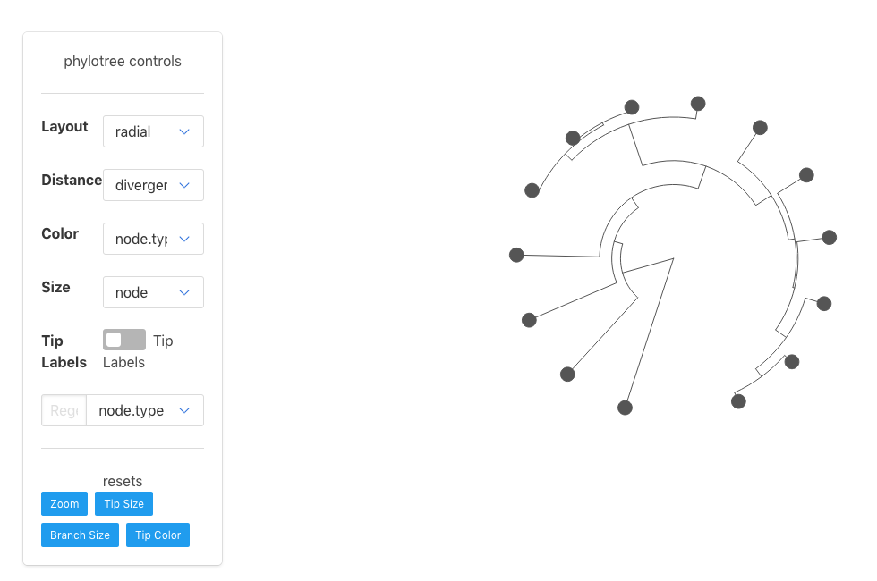

<!-- README.md is generated from README.Rmd. Please edit that file -->

```{r setup, include = FALSE}
knitr::opts_chunk$set(
  collapse = TRUE,
  comment = "#>",
  fig.path = "man/figures/README-"
)
```
# phylotree

The goal of phylotree is to provide an R interface to the phyloTree JS library in 
order to make beautiful, interactive trees from any standard data source.

** NOTE: This is currently experimental and the datastructures and functions are likely to change**

## Installation

You can install phylotree from github with:

```{r gh-installation, eval = FALSE}
# install.packages("devtools")
devtools::install_github("zachcp/phyloTreeWidget")

```

## Basic Examples

This is a basic example which shows you how to generate a tree with data from 
ape & phylobase.

```{r, eval=FALSE}
library(phylotree)
library(phylobase)
data(geospiza)
phylotree(tree=geospiza)

```




```{r, eval=FALSE}
library(ape)
data(bird.families)
phylotree(bird.families)
```


## Highlighting

Highlight information can be passed using the `highlight_tips` function. This uses a regex to find matches and applies a color and a size to the matching tips. These calls can be chained together to style the tip.


```{r, eval=FALSE}

# create some data
birddata <- data.frame(
  node = bird.families$tip.label,
  col1 = sample(1:5, length(bird.families$tip.label), replace=T),
  col2 = sample(1:500, length(bird.families$tip.label), replace=T),
  col4 = sample(LETTERS[1:10], length(bird.families$tip.label), replace=T)
)

# create the widget that has the data
p <- phylotree(tree=bird.families, data=birddata)

# highlight this tips by subsetting/finding that data
p %>% 
  highlight_tips_regex(tipregex="A", column = 'col4', highlight_color = "#8EBC66", highlight_size = 5) %>%
  highlight_tips_regex(tipregex="freg", highlight_color = "#60AA9E") %>%
  highlight_tips_regex(tipregex="apod", highlight_color = "#D9AD3D", highlight_size = 5)

```

## Hide Controls

You can hide the control panel to focus only on the tree.

```{r eval=FALSE}
p %>% 
  highlight_tips_regex(tipregex="A", column = 'col4', highlight_color = "#8EBC66", highlight_size = 5) %>%
  highlight_tips_regex(tipregex="freg", highlight_color = "#60AA9E") %>%
  highlight_tips_regex(tipregex="apod", highlight_color = "#D9AD3D", highlight_size = 5) %>%
  hide_controls()
```

## Scale Tree Branches

```{r eval=FALSE}
p %>% scale_branchthickness()
```
